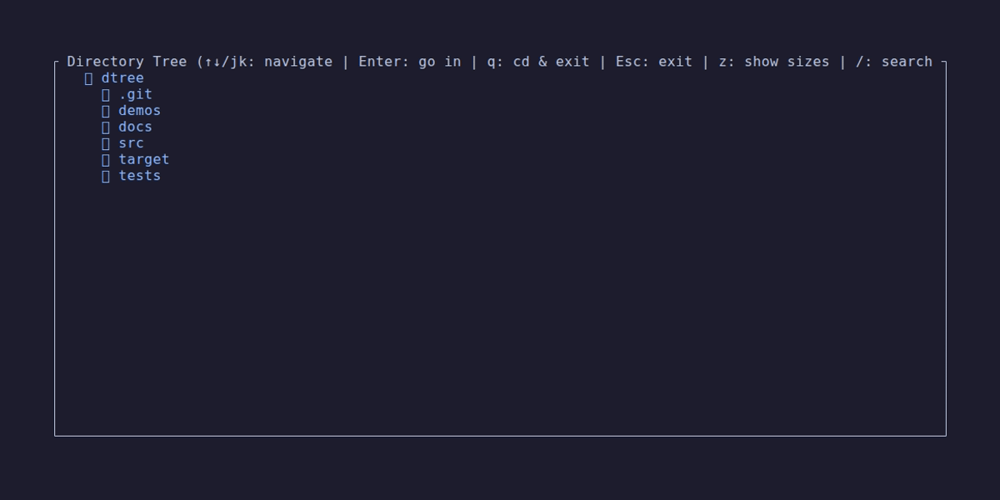
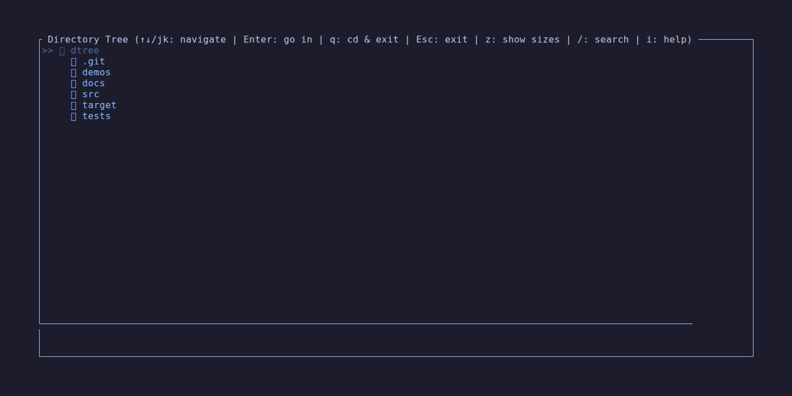
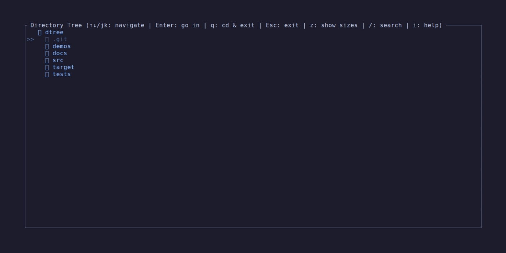

# bmrk — Demo Gallery

Visual demonstrations of bmrk features and functionality.

---

## Tree Navigation

Navigate through directories with vim-style keybindings. Expand/collapse with `l`/`h`,
move with `j`/`k`, enter directories with `Enter`, go back with `u`.

*Demo: Basic tree navigation and directory exploration*

---

## Fuzzy Search

Two-phase search: instant scan of loaded nodes, then deep background search across the
full tree. Normal (`query`) and fuzzy (`/query`) modes with ranked results.

*Demo: Folder-name search with fuzzy matching*

---

## Bookmarks

Create bookmarks with `m`, manage with CLI (`bm -l`, `bm -a`, `bm -d`),
jump instantly with `bm bookmarkname` or via the selection menu (`'`).

*Demo: Creating and using bookmarks*

---

## Key Features Shown

### Navigation
- ✅ Vim-style keybindings (j/k/h/l)
- ✅ Tree expansion/collapse
- ✅ Directory traversal and root change (Enter)
- ✅ Navigation history and undo (u/Backspace)
- ✅ Disk/drive selection (d)

### Search
- ✅ Folder-name search (/ key)
- ✅ Fuzzy matching (/query prefix)
- ✅ Background async search
- ✅ Result navigation
- ✅ Exit and cd to result (q)

### Bookmarks
- ✅ Create bookmarks (m key)
- ✅ Browse bookmarks (' key)
- ✅ CLI management (bm -l / -a / -d)
- ✅ Quick navigation (bm bookmarkname)
- ✅ Filter mode (Tab)

---

## More Information

- **[README](../README.md)** — Full documentation
- **[Key Bindings](./keybindings.md)** — Quick reference / cheatsheet

---

**Back to [README](../README.md)**
